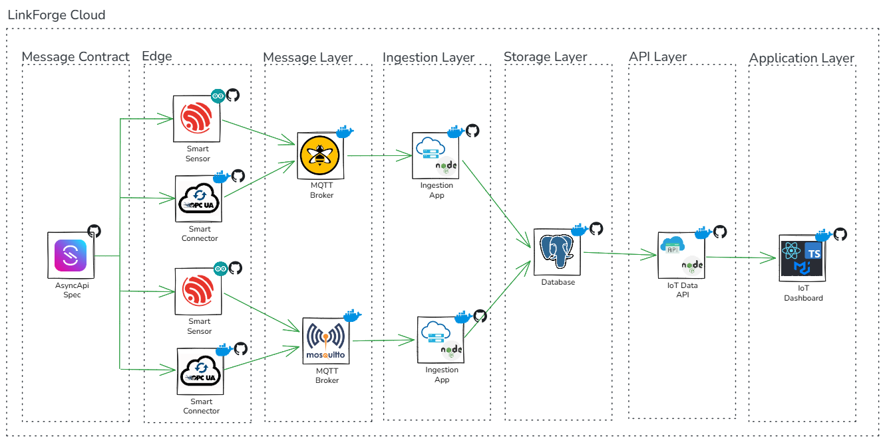

# LinkForge

LinkForge es un proyecto personal open source de un entorno IoT basado en ESP32, MQTT y TypeScript. Desde sensores DIY hasta microservicios para publicar, capturar, procesar y visualizar datos en tiempo real e históricos. Fácil de desplegar, ligero en recursos y escalable a nivel profesional.

El proyecto está en desarrollo.

## Arquitectura

### AsyncAPI Specification

Es el contrato que define cómo se comunican los componentes del sistema mediante eventos. Describe los topics, la estructura de los mensajes, quién los publica y quién los consume, asegurando que todos intercambien datos de forma consistente y predecible.

Está diseñado y versionado para permitir crecimiento sin romper compatibilidad con versiones anteriores.

Incluye:
- Definición de topics jerárquicos
- Estructura de payloads (JSON)
- Versionado de eventos
- Convenciones de naming
- Reglas de QoS y retención

---

### SmartSensor

La idea es convertir cualquier ESP32 en un SmartSensor de forma rápida y estandarizada.

Se basa en una librería que abstrae la complejidad de conexión, configuración y publicación de datos.

Actualmente enfocado en:

- Código modular para múltiples sensores
- Manejo de datapoints dinámicos
- Bajo consumo energético por defecto
- Intervalos de medición configurables
- Conectividad flexible (WiFi / red de datos)
- Publicación automática bajo AsyncAPI

---

### SmartConnector

Microservicio en TS que permite conectarse a equipos mediante protocolos industriales como OPC UA, modbus, ethernet/ip, S7, entre otros, y publicar los datos por mqtt acorde a las especificaciones del AsyncApi.

Responsabilidades:

- Conexión a PLC y equipos mediante protocolos industriales
- Transformación de payloads (normalización)
- Publicación de datos acorde al estándar
- Manejo de errores y reintentos
- Configuración de tiempos y eventos
- Un SmartConnector diferente para cada protocolo

---

### MQTT Broker

Punto central de comunicación basado en publish/subscribe.

Características esperadas:

- Soporte para múltiples clientes concurrentes
- Escalabilidad horizontal (cluster o bridge)
- Seguridad (TLS, autenticación)
- Manejo de QoS (0, 1, 2)
- Retained messages
- Shared subscriptions

Este puede correr en local o en la nube. Para pruebas se recomienda usar HiveMQ Cloud gratuito. 

---

### Ingestion App

Microservicio encargado de consumir datos desde MQTT y persistirlos.

Responsabilidades:

- Suscripción a topics definidos
- Parseo y validación de payloads
- Mapeo dinámico a tablas de base de datos
- Inserción eficiente (batch o streaming)
- Logging y trazabilidad

Diseñado para ser configurable:
- Topic → tabla destino
- Payload → esquema de almacenamiento

---

### PostgreSQL Database

Base de datos central para almacenamiento histórico.

Diseñada para:

- Alta escritura (time-series)
- Consultas eficientes
- Escalabilidad

Consideraciones:

- Particionado por tiempo
- Índices por dispositivo y timestamp
- Separación entre datos crudos y procesados

---

### IoT Data API

API backend para exponer datos a clientes.

Responsabilidades:

- Exponer endpoints 
- Consultas históricas y en tiempo real
- Agregaciones (promedios, máximos, etc.)
- Filtros por dispositivo, rango de tiempo, tipo de dato
- Autenticación y control de acceso

---

### IoT Dashboard

Frontend para visualización de datos.

Características:

- Dashboard en tiempo real
- Gráficas históricas
- Visualización por dispositivo
- Configuración de widgets
- Alertas básicas

## Objetivo del Proyecto

Crear un ecosistema IoT completo, desde hardware hasta visualización, que sea:

- Modular
- Escalable
- Fácil de replicar
- Basado en estándares

---

## Estado

Proyecto en desarrollo activo.